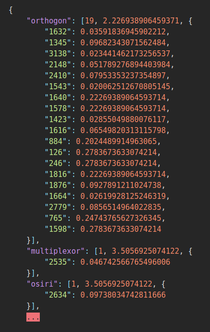
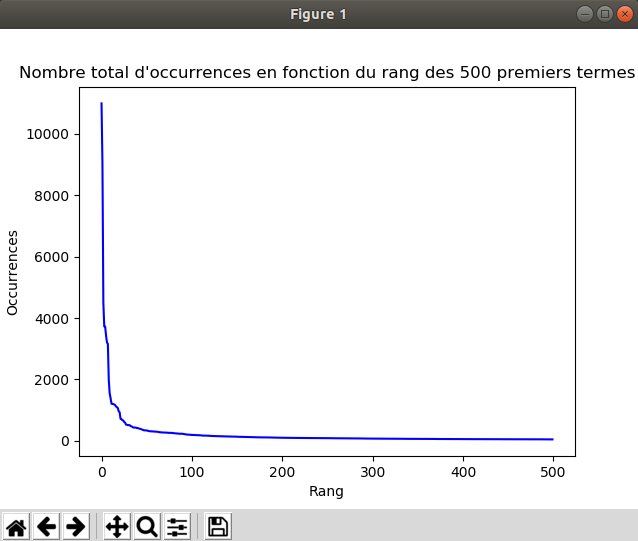
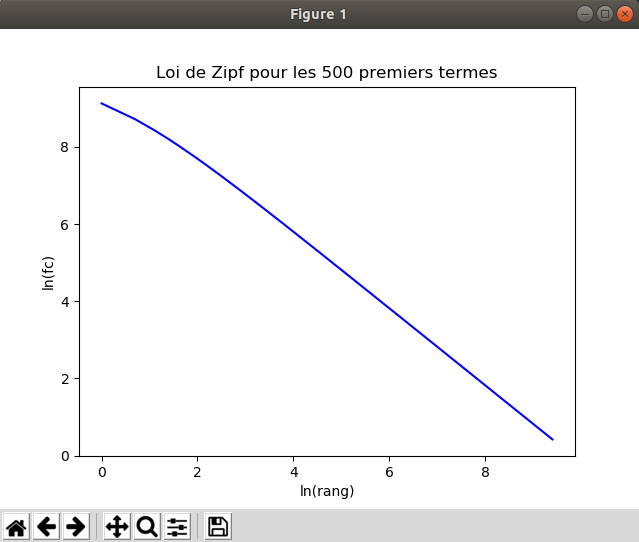

<h1 align="center">
  <br>
  <b>TF-IDF retrieval system</b>
  <br>
</h1>

<h4 align="center">An implementation of the TF-IDF method on a data collection</h4>
<i><h5 align="center">4th year practical work</h5></i>

<p align="center">
  
  
  
</p>

<p align="center">
  <a href="#overview">Overview</a> •
  <a href="#explanations">Explanations</a> •
  <a href="#license">License</a>
</p>

<p align="center">
  
</p>

## **Overview**

This project was made during my *4th year* in engineering school.

The *TF-IDF* method is presented as follows on [this dedicated webpage](http://www.tfidf.com/):
> Tf-idf stands for term frequency-inverse document frequency, and the tf-idf weight is a weight often used in information retrieval and text mining. This weight is a statistical measure used to evaluate how important a word is to a document in a collection or corpus. The importance increases proportionally to the number of times a word appears in the document but is offset by the frequency of the word in the corpus. Variations of the tf-idf weighting scheme are often used by search engines as a central tool in scoring and ranking a document's relevance given a user query.
One of the simplest ranking functions is computed by summing the tf-idf for each query term; many more sophisticated ranking functions are variants of this simple model.
Tf-idf can be successfully used for stop-words filtering in various subject fields including text summarization and classification.

At the end of the process, a dictionary such as [this one](doc/example.json) will be created; it corresponds to the *TF-IDF* representation of the vocabulary involved in the whole document collection.

## **Explanations**

#### **Part 1 :** tokenizer & Zipf's law

This first part is intended to form an orderly collection of documents in order to simplify the processing that will be carried out later.

##### - ***tokenize_cacm.py***

It is the script that makes it easy to read documents by replacing upper and lower case letters and removing numbers and symbols.

**Method :** we browse each document in the collection as well as each term (already lower-case via the `lower()` function) thanks to the **[NLTK](https://www.nltk.org/)** library. Using an adapted regular expression, we identify the terms that suit us and write them in a new file with the extension *.flt*.

**Example :**
- before processing :
```
Computer Patent Disclosures
CACM October, 1964
Kates, J. P.
```
- after processing :
```
computer
patent
disclosures
cacm
october
kates
```

##### - ***zipf.py***

This script allows several things: to calculate the frequency of apparitions of all terms appearing in the collection, the size of the vocabulary but also to draw curves representing the Zipf law.

**Method :** we use a dictionary that will have as keys the terms encountered during the course of all the documents, and as a value associated with each of these keys their frequency of appearance in the collection.
```
if word not in d:
  d[word] = 1
  TotalVocabulaire += 1
else:
  d[word] += 1
TotalOccurrences += 1
```
We write the results in a file and then thanks to the **[Matplotlib](https://matplotlib.org/)** library, we display the curve representing the Zipf law applied to our collection.

**Example :**
```
The 10 most frequently occurring words and their frequency:
('the', 10996)
('of', 9026)
('and', 4495)
('to', 3726)
('is', 3722)
('in', 3427)
('cacm', 3204)
('for', 3160)
('are', 1983)
('algorithm', 1542)

Vocabulary size : 12106
Total number of occurrences : 172933
Theoretical lambda value : 18394.277571050316
```

And here are the curves we get:

<p align="center">
  
</p>

<p align="center">
  
</p>

#### **Part 2 :** vocabulary development

This second part allows the creation of a detailed vocabulary according to the *TF-IDF* model and the inverted index.

##### - ***remove_common_words.py***

A script that first allows you to remove the polluting terms from the analysis (determinants, pronouns...). I added an argument to the function that allows the user to decide whether or not to use the **[Stemmer](https://pythonspot.com/nltk-stemming/)**, a **[NLTK](https://www.nltk.org/)** module that analyzes a term and replaces it with its root (for example, *computer* will become *comput*).

**Method :** as usual, we browse the documents of the previously processed collection, then for each term encountered, we invoke or not the **[Stemmer](https://pythonspot.com/nltk-stemming/)** to find the root of the word, but especially we check if it is a *stop-word* or not. If this is the case, then it is eliminated, otherwise it is kept by rewriting it into a new document (which will constitute the new collection).
```
if word not in stopList:
  if (stembool == True):
    NoCwFile.write(stemmer.stem(word) + " ")
  else:
    NoCwFile.write(word + " ")
else:
  print("  removing " + word)
```

**Example :**
- before processing :
```
coordinates
on
an
ellipsoid
algorithm
cacm
september
dorrer
```

- after processing :
```
coordin ellipsoid algorithm cacm septemb dorrer
```

##### - ***build_voc.py***

This is the script that will allow you to build the dictionary according to the *TF-IDF* model and the inverted index. I have commented extensively on the code of this file and I therefore refer you to it to learn about the method I used.

**Example :**
```
"osiri": [1, 3.5056925074122, {"2634": 0.09738034742811666}], "interchang": [28, 2.0585344760699806, {"1922": 0.14703817686214146, "1476": 0.018057319965526144, "1349": 0.033202168968870654, "1289": 0.2287260528966645,
```

The dictionary is read as follows:
- the root "osiri"
- appears in a single document
- and its **IDF** is 3.505692507412
- it appears in the document with the identifier 2634
- with a **TF-IDF** equal to 0.0973803434742811666 for this document
- ...

## **License**

© **[Julien Cordat-Auclair](https://github.com/jcordatauclair)**
